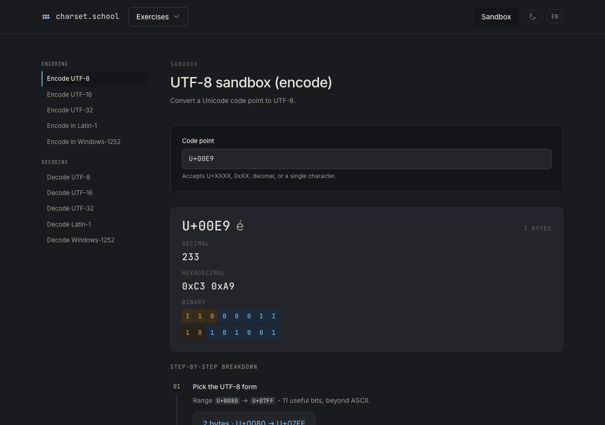
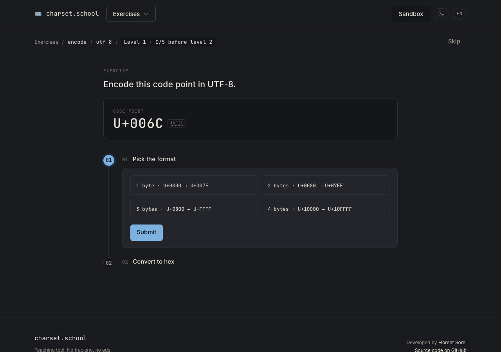

<p align="center">
  
</p>

<p align="center">
  Learn character encoding, one bit at a time.
</p>

<p align="center">
  
  
  
  
</p>

---

## Overview

charset.school is an interactive teaching tool for character encoding: take apart UTF-8, UTF-16,
UTF-32, Latin-1, and Windows-1252 by hand, no calculator, with step-by-step validation. It's
built for developers who actually want to understand bit-level mechanics, not just call a
library function.

Available online at [charset.school](https://charset.school) or self-hosted via Docker. No accounts -
progress is tracked through an anonymous token, nothing to sign up for.

<p align="center">
  
  
</p>

---

## Features

- **Interactive Sandbox** - 10 pages (encode/decode × UTF-8, UTF-16, UTF-32, Latin-1, Windows-1252)
  where you type a character or raw bytes and watch the bit-by-bit conversion broken down with
  immediate feedback.
- **Guided Exercises** - 6 playable modules (encode/decode × UTF-8, UTF-16, UTF-32) where you
  perform conversions by hand, step by step, with server-side validation, targeted hints tailored to
  your mistake, and an answer reveal after 3 attempts.
- **Progression** - levels auto-advance on a streak of 5 consecutive correct answers.
- **No accounts** - everything is keyed by an anonymous, opaque token stored in an HttpOnly
  cookie. Nothing to sign up for, nothing to lose access to.
- **i18n** - available in English (default) and French (`/fr`).
- **Self-hosted & lightweight** - single-container Docker image with embedded SQLite, minimal
  resource usage, and instant startup.

---

## Quick Start

### Docker Compose

Save the following as `compose.yml`:

```yaml
services:
  charset:
    image: ghcr.io/florentsorel/charset.school:latest
    container_name: charset
    ports:
      - "${PORT:-4000}:4000"
    volumes:
      - appdata:/data
    environment:
      SECRET_KEY_BASE: ${SECRET_KEY_BASE:?SECRET_KEY_BASE is required}
      PHX_HOST: ${PHX_HOST:-localhost}
    restart: unless-stopped

volumes:
  appdata:
```

Create a `.env` file alongside `compose.yml`:

```sh
# Generate a secret with: openssl rand -base64 48
SECRET_KEY_BASE=your-generated-secret-key-base
PHX_HOST=localhost
PORT=4000
```

Then:

```sh
docker compose up -d
```

Open [http://localhost:4000](http://localhost:4000) in your browser.

> **Pinning a version** - replace `:latest` with a specific release tag (e.g.
> `ghcr.io/florentsorel/charset.school:1.2.3`) to avoid unexpected changes on container restart.
> Available tags are listed on the
> [container registry](https://github.com/florentsorel/charset.school/pkgs/container/charset.school).

---

## Environment Variables

| Variable | Required | Description |
|---|---|---|
| `SECRET_KEY_BASE` | Yes | Signs and encrypts session cookies. Generate with `openssl rand -base64 48` |
| `PHX_HOST` | Yes | Public hostname the app is served from (e.g. `charset.school` or `localhost`) |
| `PORT` | No | Port the container listens on (default: `4000`) |
| `DATABASE_PATH` | No | Path to the SQLite database file (default: `/data/charset.db`, baked into the image) |
| `POOL_SIZE` | No | SQLite connection pool size (default: `5`) |

---

## Data & Logs

Charset writes its SQLite database under the mounted volume:

```
data/
└── charset.db
```

The database only stores anonymous progress (no accounts, no personal data). Database migrations
run automatically at container startup.

Application logs (startup, HTTP requests, errors) are written to **stdout**.

### Log rotation

Since logs go to stdout rather than a file in the volume, rotate them via Docker's logging driver -
add this to your `compose.yml`:

```yaml
    logging:
      driver: json-file
      options:
        max-size: "10m"
        max-file: "5"
```

---

## Development

If you want to run or contribute to Charset locally:

### Prerequisites

- Elixir 1.20+ (OTP 29)
- Node.js 22+
- SQLite 3

### Setup & Run

```sh
mix setup       # Install dependencies, setup database, build frontend
mix phx.server  # Start Phoenix server with Vite watcher on port 4000
```

Open [http://localhost:4000](http://localhost:4000) in your browser.

### Quality & Tests

```sh
mix precommit   # Compile with --warnings-as-errors, check format, and run tests
```

---

## License

MIT

